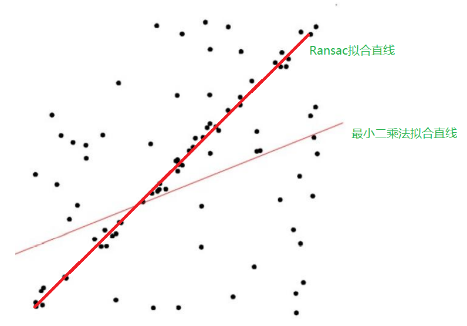

# 随机采样一致性 RANSAC

  

- [线性拟合笔记之：Ransac算法](https://blog.csdn.net/u013491950/article/details/85105946)
- [ransac算法思想](https://www.cnblogs.com/silence-cho/p/15143415.html)
---

### 算法流程
一：随机选择n个样本，作为inliers；

二：用inliers拟合一个模型（**本文做线性拟合，采用最小二乘**），然后用模型测试outliers，如果某个outliers与模型的误差小于给定的阈值，将其加入inliers；

三：如果inliers中样本个数大于设定的值，得到认为正确的模型。然后用新的inliers重新估计模型；

四：执行以上过程指定的轮数，每次产生的模型要么因为inliers太少而被舍弃，要么比现有的模型更好而被选中。

---

### Ransac优缺点
优点：

它能鲁棒的估计模型参数。例如，它能从包含大量局外点的数据集中估计出高精度的参数。

缺点：

它计算参数的迭代次数没有上限；如果设置迭代次数的上限，得到的结果可能不是最优的结果，甚至可能得到错误的结果。
RANSAC只有一定的概率得到可信的模型，概率与迭代次数成正比。
它要求设置跟问题相关的阀值。
RANSAC只能从特定的数据集中估计出一个模型，如果存在两个（或多个）模型，RANSAC不能找到别的模型。
要求数学模型已知

---
### [代码](/Common/ransac.py)
#### [测试数据](/Common/testData)