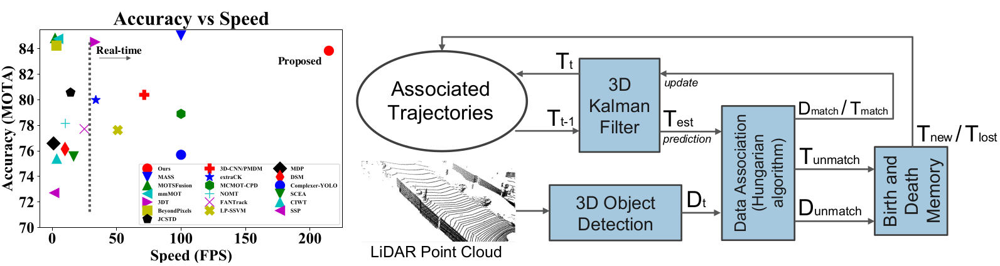
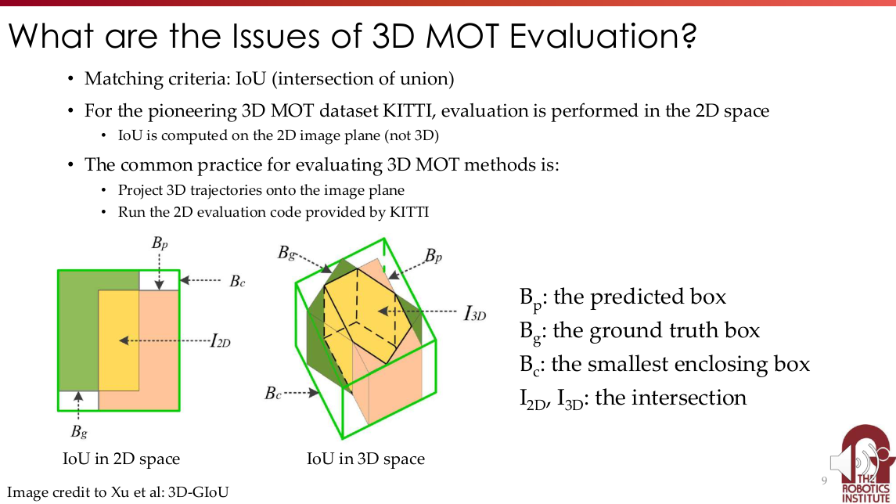
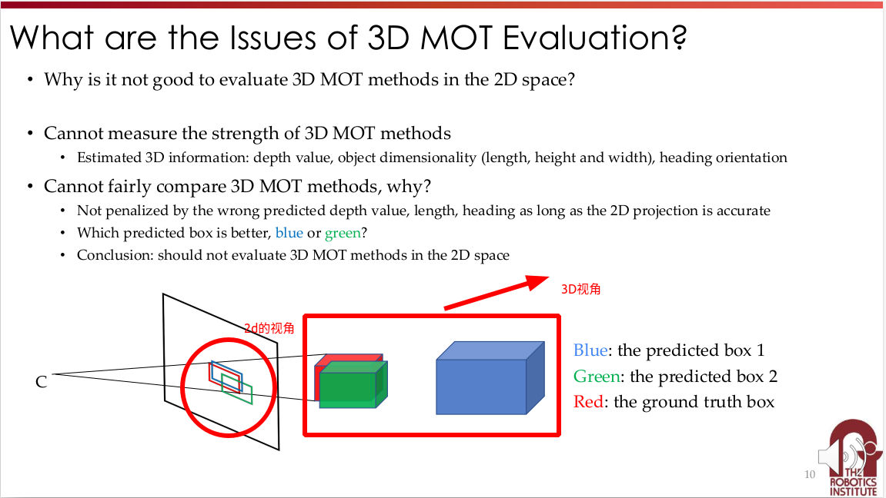

# **AB3DMOT**
<p align="center">
  
</p>

```
Compute 3D/2D bounding box IoU, only working for object parallel to ground

Input:
    Box3D instances
Output:
    iou_3d: 3D bounding box IoU
    iou_2d: bird's eye view 2D bounding box IoU

box corner order is like follows
top is bottom because y direction is negative
          1 -------- 0 		
         /|         /|
        2 -------- 3 .
        | |        | |
        . 5 -------- 4
        |/         |/
        6 -------- 7    

rect/ref camera coord:
right x, down y, front z
```

---
## Key_Words:
- [3D IOU](##-**重点摘要**)
- [匈牙利匹配](###-**匹配算法**)

---
- [代码](https://github.com/hcheng1005/AB3DMOT)
- 论文
   - [AB3DMOT: A Baseline for 3D Multi-Object Tracking (PPT)](./ppt.pdf)
   - [3D Multi-Object Tracking: A Baseline and New Evaluation Metrics](./AB3DMOT.pdf)
---

## **重点摘要**
### **3D GIOU**
<p align="center">
  
</p>

<p align="center">
  
</p>

```
在2D视角下，明显蓝色box和红色box（目标）相似度更高；
实际上（在3D视角下），绿色box才是更加合适的box
```
---

### **匹配算法**
本文采用[匈牙利算法(Hungarian Alg)](https://www.notion.so/charles-hao/Hungarian-f0cbbb77545d49409943d49b58794c5e)

