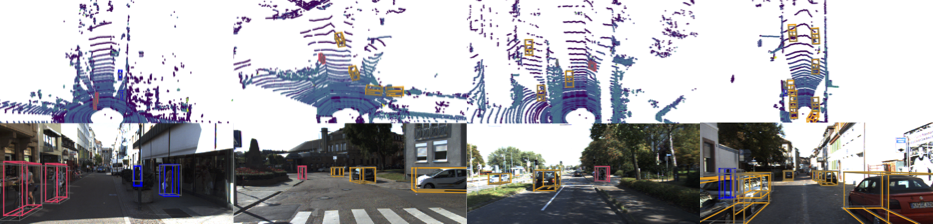
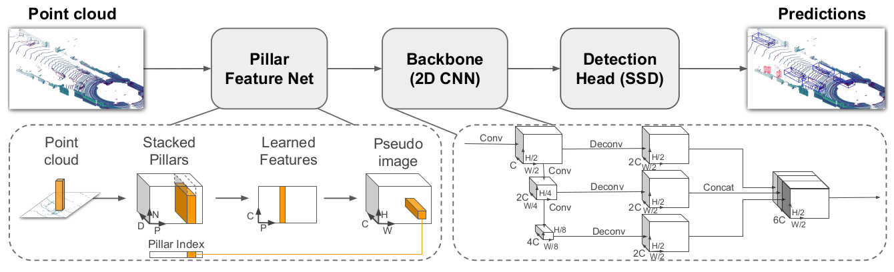
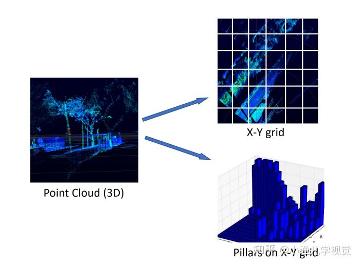
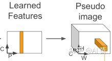
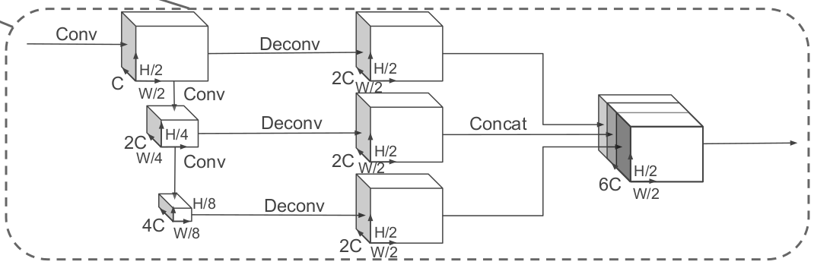

# PointPillars

<p align="center">
  
</p>

### [论文](./PointPillars.pdf)
### [源码](https://github.com/nutonomy/second.pytorch)
### [How to Use](./README.md)
---

## 解析
### 参考资料
- [PointPillars论文解析和OpenPCDet代码解析](https://blog.csdn.net/qq_41366026/article/details/123006401?spm=1001.2101.3001.6650.5&utm_medium=distribute.pc_relevant.none-task-blog-2%7Edefault%7EBlogCommendFromBaidu%7ERate-5.pc_relevant_default&depth_1-utm_source=distribute.pc_relevant.none-task-blog-2%7Edefault%7EBlogCommendFromBaidu%7ERate-5.pc_relevant_default&utm_relevant_index=9)
    - *该参考资料详细注释了**OpenPCDet**代码*
- [PointPillars解读:用于点云目标检测的快速编码器](https://zhuanlan.zhihu.com/p/404604357)
- [激光点云3D目标检测算法之PointPillars](https://zhuanlan.zhihu.com/p/428258098)
- [pointpillars代码阅读-----架构篇](https://blog.csdn.net/weixin_40805392/article/details/101262064?spm=1001.2101.3001.6650.12&utm_medium=distribute.pc_relevant.none-task-blog-2%7Edefault%7ECTRLIST%7ERate-12.pc_relevant_default&depth_1-utm_source=distribute.pc_relevant.none-task-blog-2%7Edefault%7ECTRLIST%7ERate-12.pc_relevant_default&utm_relevant_index=17)
---
## 网络拆解
### Overview
<p align="center">
  
</p>

### ***第一部分：Pillar Feature Net (PFN)***   

该部分网络结构的作用是将点**云转换为伪图像**，转换过程的示意图如下：

  <p align="center">
    
  </p>

- 1.**首先**，按照点云数据所在的X，Y轴（不考虑Z轴）将点云数据划分为一个 个的网格，凡是落入到一个网格的点云数据被视为其处在一个 pillar（柱体）里，或者理解为它们构成了一个 Pillar。

  每个点云用一个 D=9 维的向量表示，即 (x, y, z, r, xc, yc, zc, xp, yp)。其中 x, y, z, r 为该点云的真实三维坐标信息和反射强度； xc, yc, zc为该点云所处 Pillar中所有点的几何中心；xp,yp表示该点到该Pillar的x,y中心的偏移值，反应了点与几何中心的相对位置。

  假设每个样本中有 P 个非空的 pillars，每个 pillar 中有 N 个点云数据，那么这个样本就可以用一个 (D, P, N) 的张量表示。但是，如何保证每个 Pillar 中恰好有 N 个点云数据呢？

  如果每个pillar中的点云数据数据超过 N 个，那么我们就随机采样至 N 个；如果每个pillar 中的点云数据数据少于 N 个，少于的部分我们就填充为0。
  
  **通过上述方法，就将一帧点云数据编码成了一个维度为(D,P,N)的稠密张量。**
- 2.**接下来**，用一个简化版的<font color='red'> **PointNet** </font>网络进行处理。 

    首先**将每个包含D维特征的点用一个线性层+BatchNorm+ReLU激活函数处理后，生成维度为(C,P,N)的张量**；然后对每个Pillar单元进行**最大池化**操作，得到维度为(C,P)的张量。
- 3.**最后一步是通过一个scatter算子生成伪图像**。  

    这一步的方法比较简单，就是通过每个点的Pillar索引值将上一步生成的(C,P)张量转换回其原始的Pillar坐标用来创建大小为(**C,H,W)的伪图像**。

    <p align="center">
        
    </p>

    ```
    这里需要解释一下伪图像的高度H和宽度W是怎么来的：
    在第一步对点云进行Pillar划分的时候会设置XY平面上点云坐标的范围和每个Pillar的大小。假设X轴的范围是[0,69.12]，Y轴的范围是[-39.68,39.68]，每个Pillar的大小是*0.16x0.16*，那么以X轴表示宽，Y轴表示高，一个Pillar表示一个像素的话，那么这个*伪图像的宽W = (69.12 - 0) / 0.16 = 432，高H = (39.68 -(-39.68)) / 0.16 = 496*。 
    ```  

### ***第二部分：骨干网络***
<p align="center">
    
</p>
PointPillars采用了与VoxelNet一样的**RPN**(Region Proposal Network)骨干网络，该部分由一个2D卷积神经网络组成，其作用是用于在第一部分网络输出的伪图像上提取高维特征。  

**RPN骨干网分为两个子网络**：一个自顶向下的子网络用于在越来越小的空间分辨率特征图上提取特征，另一个子网络则负责将不同分辨率特征图上提取的特征通过反卷积操作进行上采样至同样维度大小然后进行串联。  

### ***第三部分：检测头***

PointPillars采用了**SSD**[1](https://blog.csdn.net/hhr603894090/article/details/123665530?utm_medium=distribute.pc_relevant.none-task-blog-2~default~baidujs_baidulandingword~default-1.pc_relevant_aa&spm=1001.2101.3001.4242.2&utm_relevant_index=4)|[2](https://www.cnblogs.com/victorywr/p/12748390.html)的检测头用来实现3D目标检测。与SSD类似，PointPillars在2D网格中进行目标检测，而Z轴坐标和高度则是通过回归的方式得到。

### ***第四部分：损失函数***
TBD