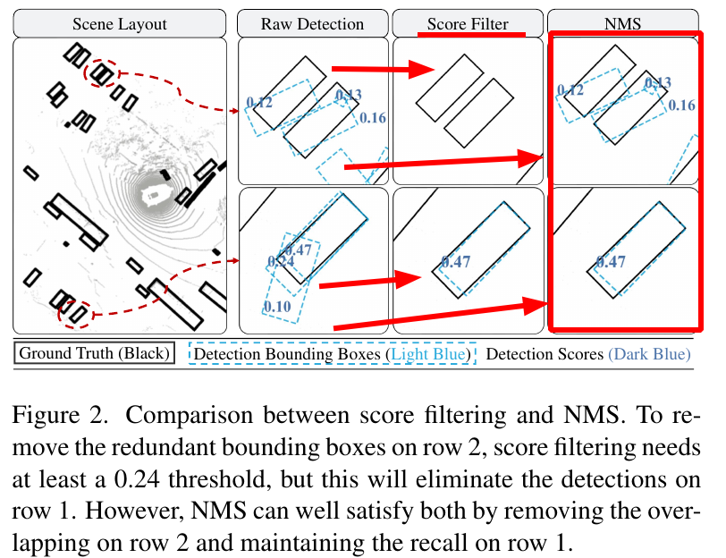

# SimpleTrack

<p align="center">
  
</p>

### [论文]()
### [源码](https://github.com/TuSimple/SimpleTrack)
---

## **论文解析**

### **1. Pre-processing of Input Detections**
<p align="center">
  
</p>

如果对输入的boundingBoxd一视同仁，可能会降低关联正确性。

因此作者做了一些改进，对输入的检测进行***NMS***[1](https://zhuanlan.zhihu.com/p/78504109)|[2](https://www.cnblogs.com/zf-blog/p/8532228.html)处理。

**NMS效果⬇**

<p align="center">
  
</p>


```
对于传统的score filter方法来说，设置删除门限0.24，可以看出，第一行的三个检测目标【0.12， 0.13 0.16】均低于0.24，因此全部被误删除；

若使用NMS方法，可以看出检测均被有效保留，且第二行的【0.24 0.10】也能被正常过滤，仅保留0.47这一个检测目标。
```
---

### **2. Motion Model**

<p align="center">
  
</p>       

---
### **3. Association**
<p align="center">
  
</p>

*这里提到：*
1. AB3DMOT用的是IoU关联以及标准卡尔曼滤波；
2. Chiu用的是Mahalanobis统计以及[GreedyMatch贪心匹配]()；
3. CenterPoint用的是L2 distance；
---
### **4. 3D GIoU(TBD)**

<p align="center">
  
</p>


<p align="center">
  
</p>

```
intersection：相交（十字路口）
union：联合
convexhull：凸包
polygon: n.多边形; 多角形
```
---
### **5. Matching Strategies**
**总体来说，两种方法：**
- 二分图-[匈牙利匹配](https://www.notion.so/charles-hao/Hungarian-f0cbbb77545d49409943d49b58794c5e)(Or [KM](https://www.notion.so/charles-hao/Kuhn-Munkres-9f33c884daea404f9dc74b755a4f7038))
- 迭代匹配最近-[贪心算法]()

```python
#distance_matrix
[[0.06819988 1.74796249 1.79149047 1.88237081 1.93779131 1.8871694
1.91372701 1.95120837 1.90176603 1.93147764]
[1.9139339  1.93473607 1.90751419 1.94369652 1.85460665 1.83223688
0.0505517  1.89896115 1.72826305 1.95637656]
[1.88653058 1.80647084 1.93086177 0.14575095 1.93367418 1.92084094
1.94198271 1.93774814 1.94195991 1.8022979 ]
[1.93528469 1.92320856 1.94670164 1.93188742 0.14801356 1.87056188
1.8474311  1.41969004 1.71515546 1.94882431]
[1.93278167 1.89671534 1.95249924 1.78411664 1.95022758 1.94607348
1.95513514 1.95362716 1.95772479 0.19920777]
[1.74643118 0.08714893 1.88401784 1.79771479 1.92576553 1.9055174
1.93510928 1.94201596 1.92203338 1.89836266]
[1.90235062 1.92152424 1.90118583 1.94241834 1.71487597 1.79723398
1.73824389 1.81996365 0.14622983 1.95785645]
[1.78815335 1.88038686 0.23075277 1.92521697 1.94942919 1.93293185
1.90787128 1.96016431 1.90095542 1.94966227]
[1.95197716 1.94243603 1.96076731 1.93859645 1.41495519 1.91297486
1.90093714 0.11387068 1.82182513 1.95374581]
[1.88892322 1.90517013 1.93516848 1.92436784 1.8766614  0.07857046
1.82883461 1.91216752 1.79642212 1.94873227]]

#index_1d
[16  0 95 51 87 23 68 34 49 72 84 37 64 38 18 66 50  1 43 70  2 98 65 53
29 21 67 88 96 15 36 14 35 94 71  3 52 20  5 90 41 59 17 86 78 62  8 60
91 55 12 76 97 85  6 10 25 61 58 31 93 73 54 22  9 33 40 75 24 11 56 92
30 27  4 83 28 26 57 63 81 13 45 32 99 39 74 79 44  7 80 42 47 89 46 19
48 69 77 82]

#index_2d 
 [[1 6]
 [0 0]
 [9 5]
 [5 1]
 [8 7]
 [2 3]
 [6 8]
 [3 4]
 [4 9]
 [7 2]
 [8 4]
 [3 7]
	...

#matched_indices 
 [[1 6]
 [0 0]
 [9 5]
 [5 1]
 [8 7]
 [2 3]
 [6 8]
 [3 4]
 [4 9]
 [7 2]]
 ```

