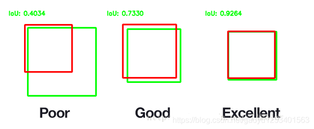
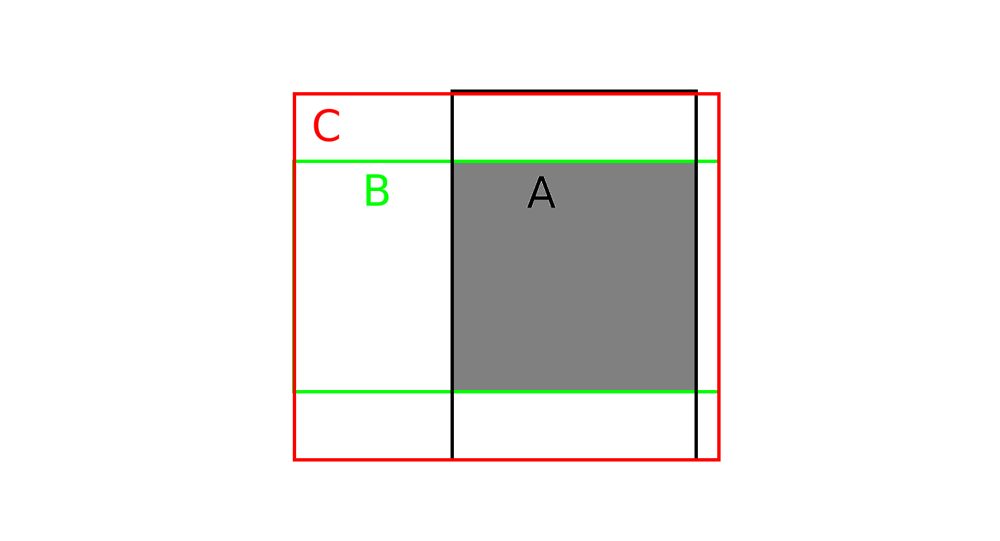

# IoU（IntersecTIon over Union）

- [GIOU详解](https://blog.csdn.net/weixin_41735859/article/details/89288493)

---
## 1. 什么是IoU（IntersecTIon over Union）

　　IoU是一种测量在特定数据集中检测相应物体准确度的一个标准。IoU是一个简单的测量标准，只要是在输出中得出一个预测范围（bounding boxex）的任务都可以用IoU来进行测量。

　　也就是说，这个标准用于测量真实和预测之间的相关度，相关度越高，该值越高。如下图所示。绿色标线是人为标记的正确结果（ground-truth），红色标线是算法预测的结果（predicted）。


## 2. IoU的计算

IoU是两个区域重叠的部分除以两个区域的集合部分得出的结果，通过设定的阈值，与这个IoU计算结果比较。

<p align="center">
  
</p>

<p align="center">
  
</p>

## 3. 示例代码

```python
def iou2d(box_a, box_b):
    boxa_corners = np.array(BBox.box2corners2d(box_a))[:, :2]
    boxb_corners = np.array(BBox.box2corners2d(box_b))[:, :2]
    reca, recb = Polygon(boxa_corners), Polygon(boxb_corners)

    # 计算重叠区域面积
    overlap = reca.intersection(recb).area  
    area_a = reca.area
    area_b = recb.area

    # iou = 重叠面积 / 集合面积
    iou = overlap / (area_a + area_b - overlap + 1e-10)
    return iou


def iou3d(box_a, box_b):
    boxa_corners = np.array(BBox.box2corners2d(box_a))
    boxb_corners = np.array(BBox.box2corners2d(box_b))[:, :2]
    reca, recb = Polygon(boxa_corners), Polygon(boxb_corners)
    overlap_area = reca.intersection(recb).area
    iou_2d = overlap_area / (reca.area + recb.area - overlap_area)

    ha, hb = box_a.h, box_b.h
    za, zb = box_a.z, box_b.z
    overlap_height = max(
        0, min((za + ha / 2) - (zb - hb / 2), (zb + hb / 2) - (za - ha / 2)))

    overlap_volume = overlap_area * overlap_height
    union_volume = box_a.w * box_a.l * ha + box_b.w * box_b.l * hb - overlap_volume

    # iou_3d = 重叠部分体积 / 集合体积
    iou_3d = overlap_volume / (union_volume + 1e-5)

    return iou_2d, iou_3d
```

## 4. GIoU
对于任意的两个Ａ、B框，首先找到一个能够包住它们的最小方框Ｃ。然后计算C \ (A ∪ B) 的面积与Ｃ的面积的比值，注：C \ (A ∪ B) 的面积为C的面积减去A∪B的面积。再用Ａ、Ｂ的IoU值减去这个比值得到GIoU。

<p align="center">
  
</p>