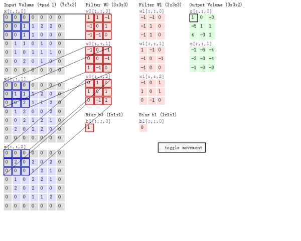

# 卷积神经网络

- [DL笔记6: 从此明白了卷积神经网络（CNN）](https://zhuanlan.zhihu.com/p/42559190)

---

## **CNN的基本概念**

- **convolution 卷积**
    

    
    

    

    
    

- **padding 填充**

    让卷积之后的大小不变

    

    
    

- **stride 步长**

    滑动卷积核时，我们会先从输入的左上角开始，每次往左滑动一列或者往下滑动一行逐一计算输出，我们将每次滑动的行数和列数称为Stride，在之前的图片中，Stride=1；在下图中，Stride=2。

    Stride的作用：是成倍缩小尺寸，而这个参数的值就是缩小的具体倍数，比如步幅为2，输出就是输入的1/2；步幅为3，输出就是输入的1/3。以此类推。

    

    
    

    

    
    

- **pooling 池化**

    这个pooling，是为了提取一定区域的主要特征，并减少参数数量，防止模型过拟合。 比如下面的MaxPooling，采用了一个2×2的窗口，并取stride=2：

    

    
    

- **对多通道（channels）图片的卷积**

    彩色图像，一般都是RGB三个通道（channel）的，因此输入数据的维度一般有三个：（长，宽，通道）。 比如一个28×28的RGB图片，维度就是(28,28,3)。

    前面的引子中，输入图片是2维的(8,8)，filter是(3,3)，输出也是2维的(6,6)。

    如果输入图片是三维的呢（即增多了一个channels），比如是(8,8,3)，这个时候，我们的filter的维度就要变成(3,3,3)了，它的 最后一维要跟输入的channel维度一致。 这个时候的卷积，是三个channel的所有元素对应相乘后求和，也就是之前是9个乘积的和，现在是27个乘积的和。因此，输出的维度并不会变化。还是(6,6)。

    但是，一般情况下，我们会 使用多了filters同时卷积，比如，如果我们同时使用4个filter的话，那么 输出的维度则会变为(6,6,4)。

    我特地画了下面这个图，来展示上面的过程：

    

    
    
