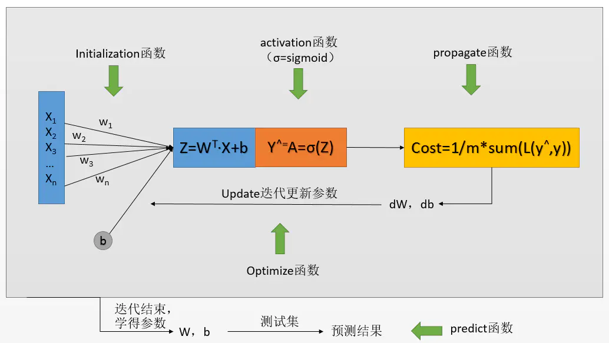
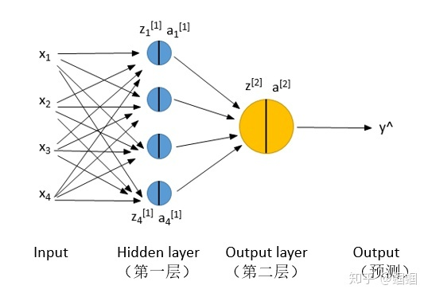
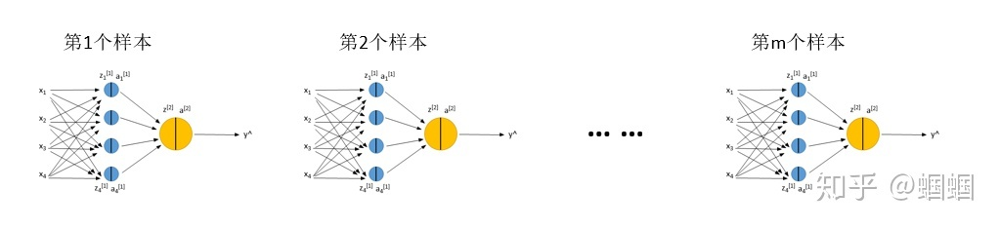
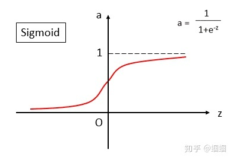
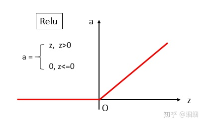
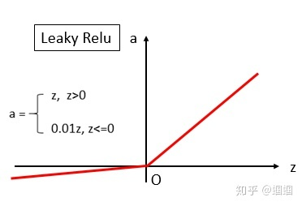
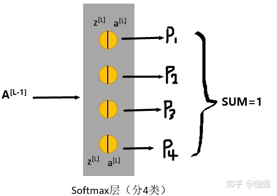
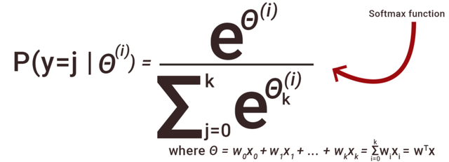

# 神经网络

<p align="center">
  
</p>

---
- [DL笔记3：一步步亲手用python实现Logistic Regression](https://www.jianshu.com/p/eb5f63eaae2b)
- [最基础的神经网络](https://zhuanlan.zhihu.com/p/38850641)
- [DL笔记4: 神经网络详解，正向传播和反向传播](https://zhuanlan.zhihu.com/p/41138014)
- [神经网络15分钟入门！足够通俗易懂了吧](https://zhuanlan.zhihu.com/p/65472471)
---

## **一、什么是神经网络**
我们这里讲解的神经网络，就是在Logistic regression的基础上增加了一个或几个隐层（hidden layer），下面展示的是一个最简单的神经网络，只有两层：

**两层神经网络:**

<p align="center">
  
</p>

需要注意的是，上面的图是“两层”，而不是三层或者四层，**输入和输出不算层!**

这里，我们先规定一下记号（Notation）：
```
z是x和w、b线性运算的结果，z=wx+b；
a是z的激活值；
下标的1,2,3,4代表该层的第i个神经元（unit）；
上标的[1],[2]等代表当前是第几层。
y^代表模型的输出，y才是真实值，也就是标签
```
另外，有一点经常搞混：

```
上图中的x1，x2，x3，x4不是代表4个样本！而是一个样本的四个特征（4个维度的值）！
```

<p align="center">
  
</p>

---

## **神经网络的“两个传播”：**

### **前向传播（Forward Propagation）**

前向传播就是从input，经过一层层的layer，不断计算每一层的z和a，最后得到输出y^ 的过程，计算出了y^，就可以根据它和真实值y的差别来计算损失（loss）。

### **反向传播（Backward Propagation)**

<font color='yellow'> 反向传播就是根据损失函数L(y^,y)来**反方向地计算每一层的z、a、w、b的偏导数（梯度）** </font>，从而更新参数。

每经过一次前向传播和反向传播之后，参数就更新一次，然后用新的参数再次循环上面的过程。这就是神经网络训练的整个过程。

---
##  **二、前向传播**

如果用for循环一个样本一个样本的计算，显然太慢，看过我的前几个笔记的朋友应该知道，我们是使用Vectorization，把m个样本压缩成一个向量X来计算，同样的把z、a都进行向量化处理得到Z、A，这样就可以对m的样本同时进行表示和计算了。[相关链接](https://zhuanlan.zhihu.com/p/38853456)

用公式在表示一下我们的两层神经网络的前向传播过程：
```
Layer 1:Z[1] = W[1]·X + b[1]A[1] = σ(Z[1])
Layer 2:Z[2] = W[2]·A[1] + b[2]A[2] = σ(Z[2])
```

对于损失函数，就跟Logistic regression中的一样，使用<font color='yellow'> **“交叉熵（cross-entropy）”**</font>，公式就是

- 二分类问题：
    ```
    L(y^,y) = -[y·log(y^ )+(1-y)·log(1-y^ )]
    ```

- 多分类问题：
    ```
    L=-Σy(j)·y^(j)
    ```

这个是每个样本的loss，我们一般还要计算整个样本集的loss，也称为cost，用J表示，J就是L的平均：
```
J(W,b) = 1/m·ΣL(y^(i),y(i))
```

上面的求Z、A、L、J的过程就是正向传播。

---

## **三、反向传播**

- [一文弄懂神经网络中的反向传播法——BackPropagation](https://www.cnblogs.com/codehome/p/9718611.html)
- [详解反向传播算法(上)](https://zhuanlan.zhihu.com/p/25081671)
- [详解反向传播算法(下)](https://zhuanlan.zhihu.com/p/25416673)

反向传播说白了根据根据J的公式对W和b求偏导，也就是求梯度。因为我们需要用梯度下降法来对参数进行更新，而更新就需要梯度。
但是，根据求偏导的链式法则我们知道，第l层的参数的梯度，需要通过l+1层的梯度来求得，因此我们求导的过程是“反向”的，这也就是为什么叫“反向传播”。

而且，像各种深度学习框架TensorFlow、Keras，它们都是只需要我们自己构建正向传播过程，反向传播的过程是自动完成的，所以大家也确实不用操这个心。

进行了反向传播之后，我们就可以根据每一层的参数的梯度来更新参数了，更新了之后，重复正向、反向传播的过程，就可以不断训练学习更好的参数了。

---

## **四、激活函数**
- **sigmoid函数（σ）**
    <p align="center">
    
    </p>

- **ReLU**
    <p align="center">
    
    </p>

- **Leaky ReLU**
    <p align="center">
    
    </p>

- **Softmax**
    <p align="center">
    
    </p>

    <p align="center">
    
    </p>

